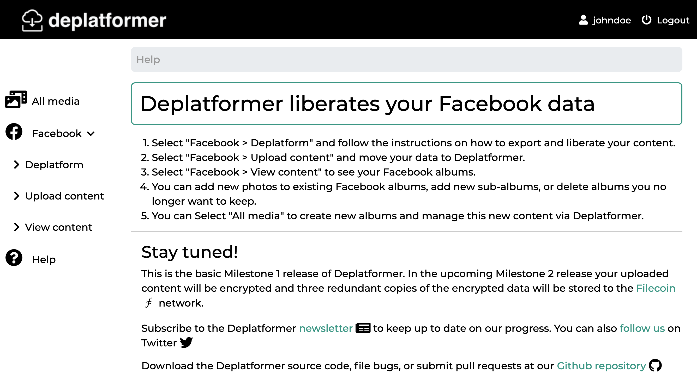

# Deplatformer

Deplatformer liberates your Facebook content and uploads encrypted copies to decentralized Filecoin storage.

Deplatformer is built with [Flask](https://palletsprojects.com/p/flask/), [Electron](https://www.electronjs.org/), and [Pygate](https://pygate.tech).  

Seed funding for this project has been generously provided by the [Filecoin Foundation](https://fil.org/).

For more information check out our Substack [newsletter](https://deplatformer.substack.com/) and follow us on [Twitter](https://twitter.com/deplatformer_io).
